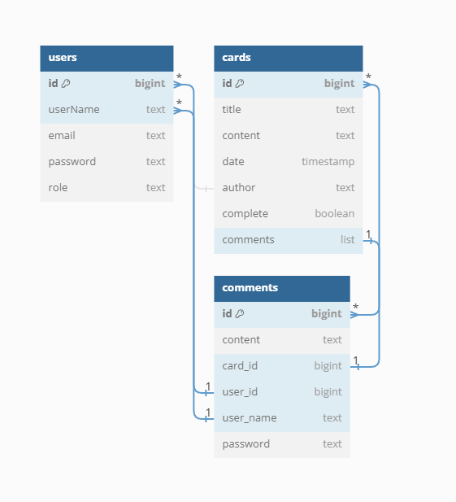

# gogoCard API

gogoCard API는 할 일 카드를 생성, 조회, 수정, 삭제할 수 있는 RESTful API입니다.

---
## Card API 명세

### 카드 검색 (제목 기준)

- **Endpoint**: `GET /api/cards/search/title`
- **Auth Required**: Yes (Roles: MEMBER, ADMIN)
- **Parameters**:
    - `title` (string) - 검색하고자 하는 카드의 제목
- **Success Response**:
    - **Code**: `200 OK`
    - **Content**: `List<CardResponse>`

### 카드 검색 (완료 여부 기준)

- **Endpoint**: `GET /api/cards/search/complete`
- **Auth Required**: Yes (Roles: MEMBER, ADMIN)
- **Parameters**:
    - `isCompleted` (boolean) - 완료 여부 (False -> NO_COMPLETE, TRUE -> COMPLETE)
- **Success Response**:
    - **Code**: `200 OK`
    - **Content**: `List<CardResponse>`

### 전체 카드 목록 페이징하여 조회

- **Endpoint**: `GET /api/cards`
- **Auth Required**: Yes (Roles: MEMBER, ADMIN)
- **Parameters**:
    - `page` (int) - 페이지 번호
    - `size` (int) - 페이지 당 항목 수 (기본 15)
    - `sort` (string) - 정렬 기준 (기본 'id')
    - `_isCompleted` (boolean, optional) - 완료 여부 필터
- **Success Response**:
    - **Code**: `200 OK`
    - **Content**: `Page<CardResponse>`

### 특정 카드 상세 조회

- **Endpoint**: `GET /api/cards/{cardId}`
- **Auth Required**: Yes (Roles: MEMBER, ADMIN)
- **Path Variables**:
    - `cardId` (long) - 조회하고자 하는 카드의 ID
- **Success Response**:
    - **Code**: `200 OK`
    - **Content**: `CardResponse`

### 새로운 카드 생성

- **Endpoint**: `POST /api/cards`
- **Auth Required**: Yes (Roles: MEMBER, ADMIN)
- **Request Body**: `CreateCardRequest`
- **Success Response**:
    - **Code**: `201 CREATED`
    - **Content**: `CardResponse`

### 기존 카드 업데이트

- **Endpoint**: `PUT /api/cards/{cardId}`
- **Auth Required**: Yes (Roles: MEMBER, ADMIN)
- **Path Variables**:
    - `cardId` (long) - 업데이트 하고자 하는 카드의 ID
- **Request Body**: `UpdateCardRequest`
- **Success Response**:
    - **Code**: `200 OK`
    - **Content**: `CardResponse`

### 카드 삭제

- **Endpoint**: `DELETE /api/cards/{cardId}`
- **Auth Required**: Yes (Roles: MEMBER, ADMIN)
- **Path Variables**:
    - `cardId` (long) - 삭제하고자 하는 카드의 ID
- **Success Response**:
    - **Code**: `204 NO CONTENT`

### 카드에 댓글 생성

- **Endpoint**: `POST /api/cards/{cardId}/comments`
- **Auth Required**: Yes (Roles: MEMBER, ADMIN)
- **Path Variables**:
    - `cardId` (long) - 댓글을 생성할 카드의 ID
- **Request Body**: `CreateCommentRequest`
- **Success Response**:
    - **Code**: `201 CREATED`
    - **Content**: `CommentResponse`

### 카드의 댓글 업데이트

- **Endpoint**: `PUT /api/cards/{cardId}/comments/{commentId}`
- **Auth Required**: Yes (Roles: MEMBER, ADMIN)
- **Path Variables**:
    - `cardId` (long) - 댓글이 있는 카드의 ID
    - `commentId` (long) - 업데이트 하고자 하는 댓글의 ID
- **Request Body**: `UpdateCommentRequest`
- **Success Response**:
    - **Code**: `200 OK`
    - **Content**: `CommentResponse`

### 카드의 댓글 삭제

- **Endpoint**: `DELETE /api/cards/{cardId}/comments/{commentId}`
- **Auth Required**: Yes (Roles: MEMBER, ADMIN)
- **Path Variables**:
    - `cardId` (long) - 댓글이 있는 카드의 ID
    - `commentId` (long) - 삭제하고자 하는 댓글의 ID
- **Success Response**:
    - **Code**: `204 NO CONTENT`

### 카드 목록 정렬하여 조회

- **Endpoint**: `GET /api/cards/sort`
- **Auth Required**: Yes (Roles: MEMBER, ADMIN)
- **Parameters**:
    - `sort` (string) - 정렬 방식 ('asc' 또는 'desc')
- **Success Response**:
    - **Code**: `200 OK`
    - **Content**: `List<CardResponse>`

### 카드 작성자 기반 조회

- **Endpoint**: `GET /api/cards/{cardId}/userName`
- **Auth Required**: Yes (Roles: MEMBER, ADMIN)
- **Path Variables**:
    - `cardId` (long) - 조회하고자 하는 카드의 ID
- **Parameters**:
    - `userName` (string) - 카드의 작성자
- **Request**: `CallCardByAuthorRequest`
- **Success Response**:
    - **Code**: `200 OK`
    - **Content**: `List<CardResponse>`

### 카드 완료 처리

- **Endpoint**: `PATCH /api/cards/{cardId}/complete`
- **Auth Required**: Yes (Roles: MEMBER, ADMIN)
- **Path Variables**:
    - `cardId` (long) - 완료 처리할 카드의 ID
- **Success Response**:
    - **Code**: `200 OK`
    - **Content**: `CardResponse`

---

## User API 명세

### 사용자 회원가입

- **Endpoint**: `POST /api/users/signup`
- **Parameters**: 없음
- **Request Body**:
    - `CreateUserRequest` - 회원가입 정보가 담긴 객체
- **Success Response**:
    - **Code**: `200 OK`
    - **Content**: `UserResponse` - 회원가입 후 반환되는 사용자 정보

### 사용자 로그인

- **Endpoint**: `POST /api/users/signin`
- **Parameters**: 없음
- **Request Body**:
    - `SignInRequest` - 로그인 정보가 담긴 객체
- **Success Response**:
    - **Code**: `200 OK`
    - **Content**: `SignInResponse` - 로그인 성공 후 반환되는 토큰 및 사용자 정보

---

## ERD

